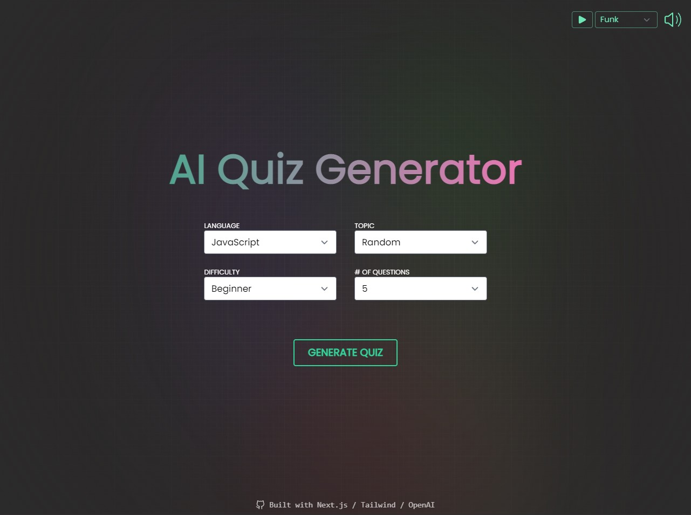
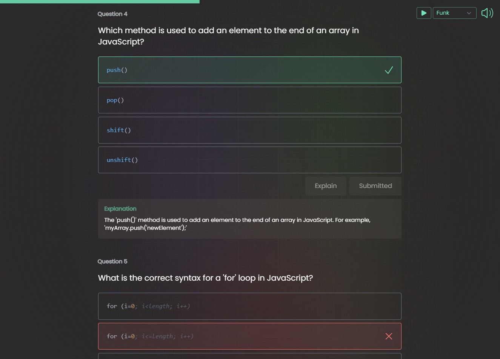

# AI Quiz Generator

Uses OpenAI's ChatGPT API to generate multiple choice quiz with user defined language, topic, and difficulty.

Features a loading screen with random facts to give the user something to do while the data is retrieved from the API and an ending screen with score-determined gifs and sarcastic messages.

[View Live App](https://skillquiz.vercel.app/)/)

## Features
- Customisable language, topic, difficulty, and number of questions
- Loading screen that displays the live response stream and random webdev/programming facts (gives you something to do as it can take around 20-30 seconds for the quiz to generate)
- Multiple choice Ed-style quiz with explanations and a progress bar
- End screen with gifs, sarcastic messages, and confetti (>= 80%) that adapt to your quiz score

## Tech Used

- Next.js 13.4 (using the new App router)
- Tailwind CSS
- OpenAI's `gpt-3-turbo` API

## Packages Used
- [framer-motion](https://www.framer.com/motion/) (for animations)
- [highlight.js](https://www.npmjs.com/package/highlight.js) (for syntax highlighting)
- [react-confetti](https://www.npmjs.com/package/react-confetti)
- [react-loader-spinner](https://www.npmjs.com/package/react-loader-spinner)
- [react-icons](https://react-icons.github.io/react-icons/)
- [react-use](https://github.com/streamich/react-use) (for the `useAudio()` hook)
- [react-simple-typewriter](https://www.npmjs.com/package/react-simple-typewriter)

## Screenshots

